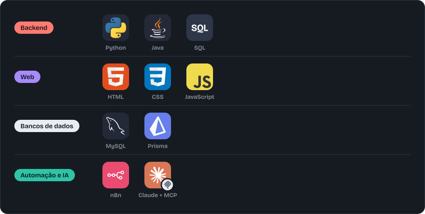

  

Oi, eu sou o Henrique 👋

Só sinto que entendi uma coisa quando construo ela, quebro, conserto e anoto o que aprendi no caminho. Ultimamente minha curiosidade está na combinação de IA, automação, bancos de dados e backend, que é o que faz um sistema pensar, lembrar e trabalhar sozinho.

## Em que estou trabalhando

<b>Aspen Core</b>

 

Plataforma web do ecossistema Aspen Key, um dispositivo físico de segurança para empresas. Reúne conta de usuário, loja, painel administrativo e gestão dos dispositivos. Cuido da parte de software, como backend, banco de dados e testes.

## Stack

  

## Ferramentas

  

## O que me interessa

IA aplicada e automação, ciência de dados, segurança e criptografia.

  <picture>
    <source media="(prefers-color-scheme: dark)" srcset="https://raw.githubusercontent.com/henrifernandez/henrifernandez/output/github-contribution-grid-snake-dark.svg">
    
  </picture>

